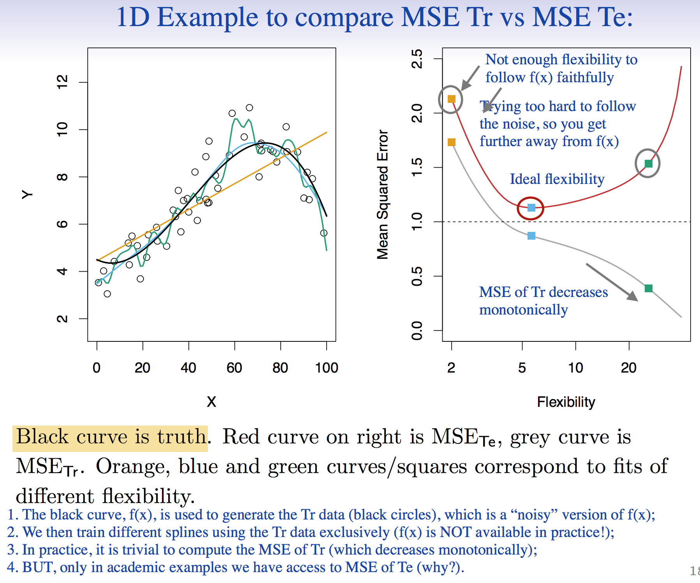
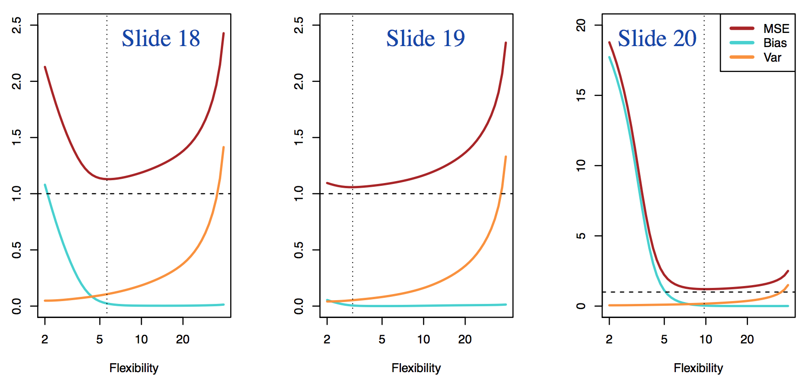
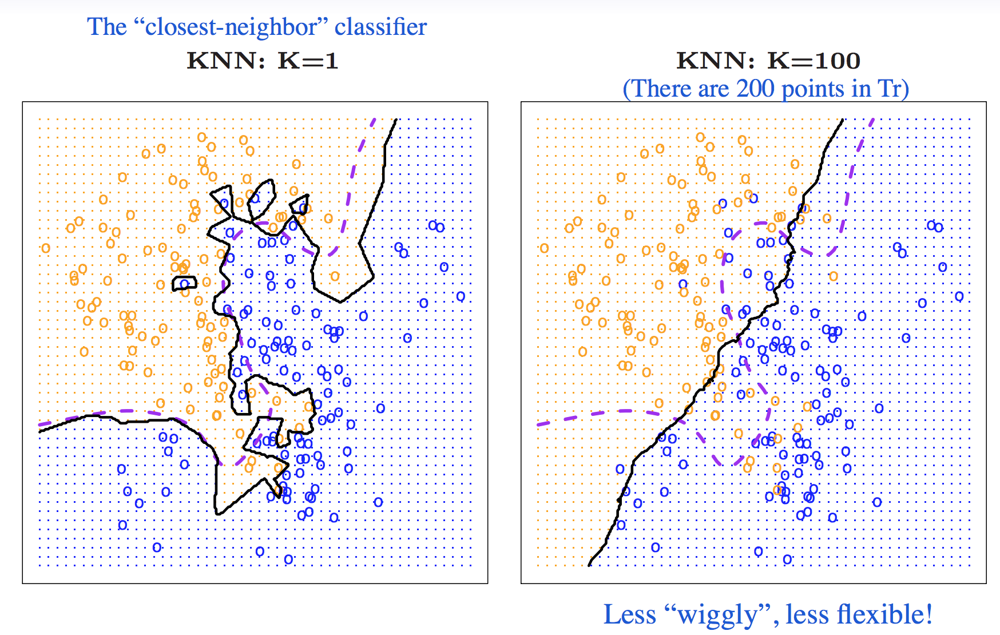
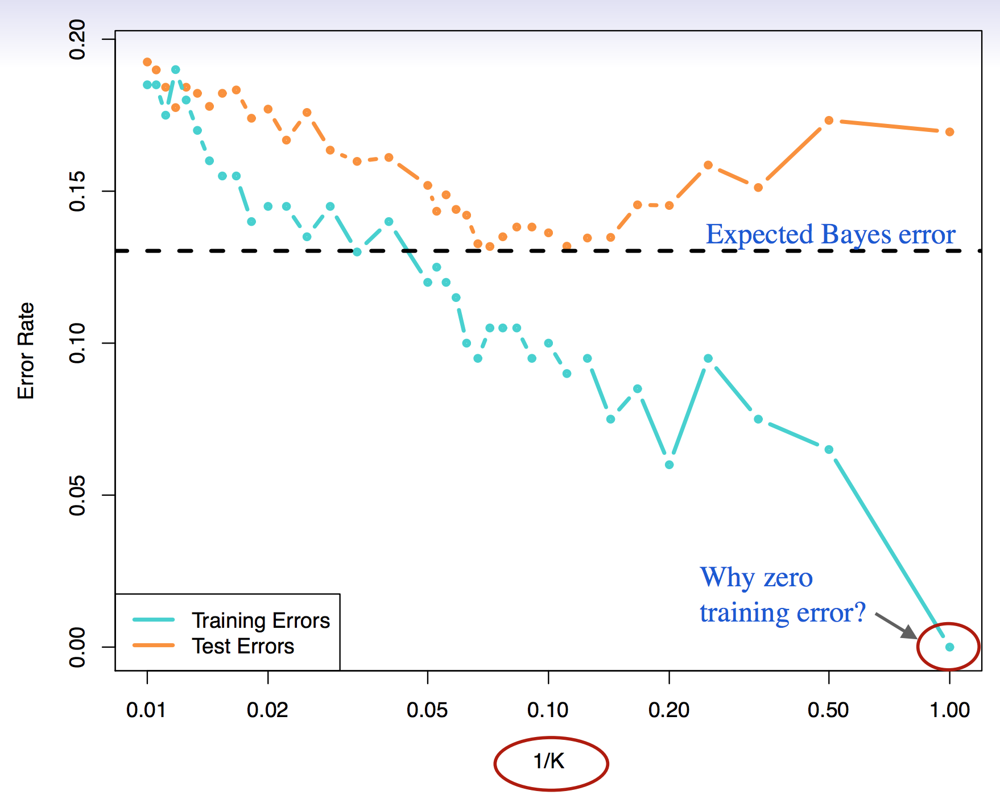
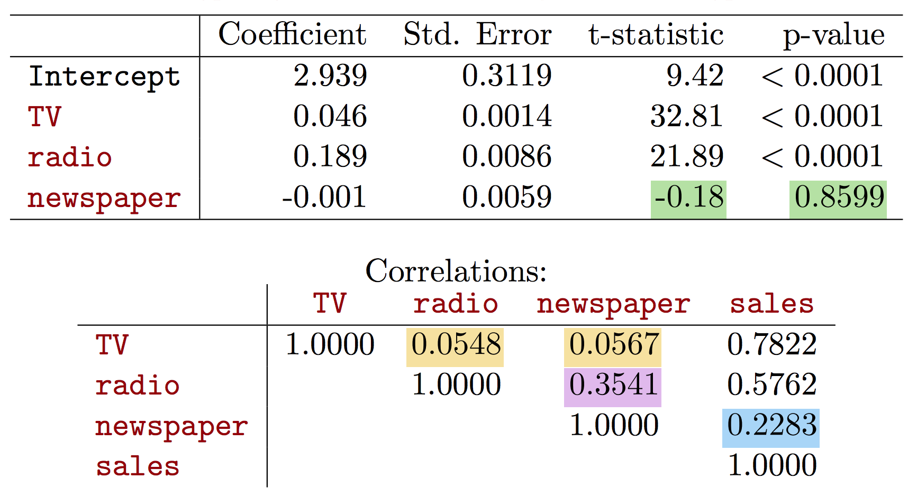
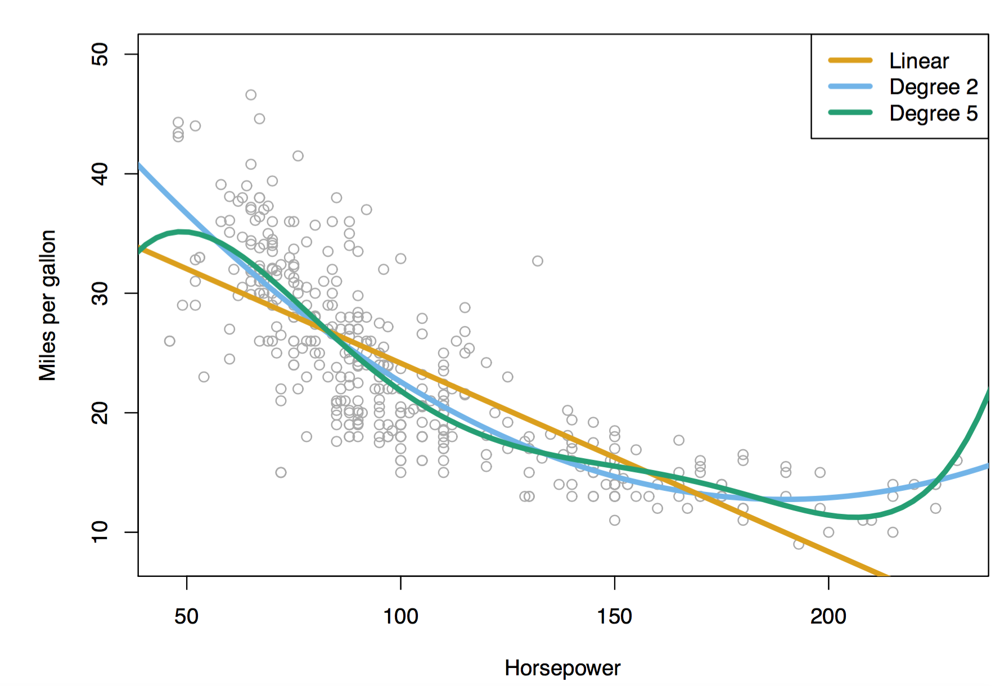
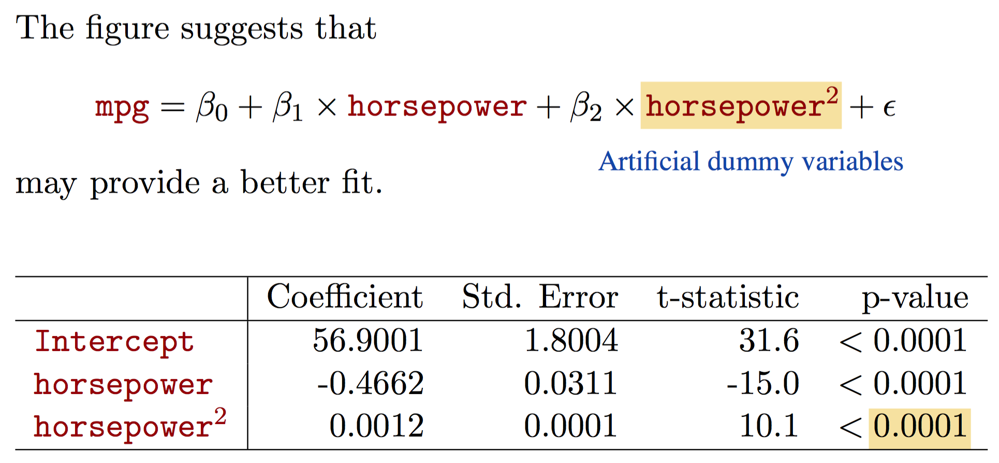

# Chapter 2 Notes

## Fundamental Problem

$Y = f(x) + \epsilon$ is a function we don't know but want to estimate. $x$ is a regressor vector, $Y$ is our output, and $\epsilon$ is our _irreducible error_ that results for either missing regressors in $x$ or from unmeasurable variance in nature.

---

## Two classes of problems

> Prediction: Estimate $Y$ with $\hat{Y} = \hat f(x) + \epsilon$.

> Inference: see how $Y$ changes with changes in $X_1 ... X_p$

---

## Classes of Problems

_Regression_ problems deal with quantitative responses. 

1. parametric: reduces problem of estimating $f$ to a problem of estimating parameters
	1. i.e: When we want to use linear model $f(x) = B_0 + B_1X_1 + ... + B_pX_p$, we only have the estimate $B_0 + B_1 + ... + B_p$
	1. Generally more flexible - gets us further from true form of $f$
	1. More restrictive but generally more interperable than non-parametric models
1. non-parametric: 
	1. no assumption about shape/form of $f$
	1. tries to use $\hat f$ that is as close to data-points as possible
	1. Needs very large number of observations

_Classification_ problems deal with categorical or qualitative responses. Note that the type of predictor indicates what type of problem we are trying to solve.

---

## Assessing Model Accuracy
Measuring Quality of Fit - to quantify how "off" predictions are from true response data

We can use _mean squared error_

$$MSE = \frac{1}{n}\sum_{i=1}^{n}(y_i - \hat{f}(x_i))$$ where $x_i$ is the ith observation.

- MSE is defined for both training and test data sets. 

- **Note:** Can't just minimize training MSE to minimize test MSE. Most learning models work to minimize training MSE, which does not guarantee a smallest test MSE (might overfit to data). Flexible methods tend to have a higher chance of "overfitting"  training data, resulting in a test MSE.

---

## Bias-Variance Tradeoff

$$E[testMSE] = Var(\hat f(x)) + [Bias(\hat{f}(x_0))]^2 + Var(\epsilon)$$

> Bias: Error introduced by approximating real-life problem with simple models (i.e: linear model).

> Variance: the amount by which $\hat{f}$ would change if it was estimated using a different training data set; ideally, $\hat f$ shouldn't vary much across training sets 

- As model flexibility increases, bias generally decreases and variance increases
- As we increase flexibility, the bias initially decreases faster than the variance increases. At some point, the variance increases faster than the bias declines and thus the test MSE begins to increase.
- Note that test MSE will always be above $\epsilon$
- test MSE is minimized when sum of variance and bias is lowest

---

## Classification

### Training Error Rate
Use _training error rate_ to quantify accuracy of $\hat f$:

$$\frac{1}{n}\sum_{i=1}^{n}I(Y_i \neq \hat Y_i)$$
where $I$ is an indicator random variable that is 1 if $Y_i \neq \hat Y_i$ and 0 otherwise

Basically, training error rate averages all misclassifications across $n$ observations

### Test Error Rate

$Ave(I(Y_i \neq \hat Y_i))$ - a good classifier minimizes this

### The Bayes classifier
Assign a test observation $x_0$ a class $j$ for which $P(Y = j | X = x_0)$ is the highest.

> Bayes Error Rate: $1 - E(max_jPr(Y = j | X))$ - expectation just averages probability over all possible X
- Bayes Error Rate is analagous to irreducible error

### KNN

Brief Description: For an observation $i$, we look at the class of its $K$ nearest neighbors' classes. The class $k$ with the highest propotion wins and we assign $i$ the class $k$.

Classifier that classifies according to

$$Pr(Y=j|X=x) = \frac{1}{K}\sum_{i\in N_0}I(y_i = j)$$

- Note that low K means high model flexibility and high K means low model flexibility

- We also observe the characteristic U shape as we increase model flexibility in the error rates in KNN

# Chapter 3
In linear regression we assume that true $ f(x)$ is linear, or can be modeled by $f(x) = B_0 + B_1X_1 + ... B_pX_p$. We estimate $f(x)$ with $\hat f(x) = \hat B_0 + \hat B_1X_1 + ... \hat B_pX_p$.

---

## Estimating Coefficients
Simple linear regression is a parametric problem, in that we need to estimate parameters $B_0$ and $B_1$. 

Simple linear regression makes a line that is as close to datapoints as possible. We quantify closeness with RSS, defined as: 

$$RSS = \sum_{i = 1 }^{n}(Y_i - \hat f(x_i))^2 = \sum_{i = 1 }^{n}(Y_i - \hat B_0 - \hat B_1X_1)^2$$

We want to find the parameters that minimize RSS! The estimated parameters are

$$\hat B_1 = \frac{\sum_{i=1}^{n}(x_i - \bar x)(y_i - \bar y)}{\sum_{i=1}^{n}(x_i - \bar x)^2}$$

$$\hat B_0 = \bar y - \hat B_1 \bar x$$

where $\bar y$ and $\bar x$ are the averages over all x and y values respectively.

---

## Assessing Accuracy of Coefficient Estimates

> Hypothesis testing: Let there be a null hypothesis $H_0$ and an alternative hypothesis $H_a$. After running some tests, if we find that there are results that are statisticially significant in favor of $H_a$, then we reject $H_0$.

In the case of assessing coefficient estimates, we let $H_0: B_1 = 0$ and $H_a: B_1 \neq 0$. 

In order to judge whether or not $B_0$ might be 0, we can use a t-statistic, a measurement drawn from analysis of our estimations.

$$t = \frac{\hat B_1 - 0}{SE(\hat B_1)}$$

The t-statistic is a measurement of the number of standard deviations $\hat B_1$ is away from 0 using a student's t-distribution. If $t$ is large, it indicates that $B_1$ is likely non-zero. More precisely, if the _p-value_ associated with the t-statistic is large, it is likely that $B_1$ is non-zero. Generally we use $t > 2$ as our threshold for rejecting $H_0$.

---

## Assessing Model Accuracy

We've rejected $B_1 = 0$. Now we need to see how close our estimate is to the true $B_1$.

> Residual Standard Error: $RSE = \sqrt{\frac{1}{n-2}RSS}$; average amount that response will deviate from true regression line; is an estimate for standard deviation of $\epsilon$.

> $R^2$ statistic: $R^2 = \frac{RSS - RSS}{TSS}$; proportion of variance explained by a linear model w.r.t to $TSS = \sum(y_i - \bar y)^2$
- TSS is the total variability in the response.
- RSS explains some of the variability.
- TSS - RSS is the variability that's left over after regression

$R^2$ has an interperetational advantage over RSE since its always between 0 and 1.

Can use confidence intervals:
- 95% confident that the true value of $B_1$ lies between [$\hat B_1 - 2SE(\hat B_1), \hat B_1 + 2SE(\hat B_1)$] since 2.5% of data lies above and below t = 2 in a student's t-distribution. 

---

## Multiple Linear Regression

Now, predictor is of the form $\hat Y = \hat B_0 + \hat B_1X_1 + ... \hat B_pX_p$

> $B_j$: average effect on Y for a unit increase in $X_j$ holding all other regressors fixed

_Why not just run a simple linear regression for each regressor?_

1. Can't see effect of 1 regressor in presence of others
1. Each equation will ignore other regressors
1. Can't account for correlations between regressors

We estimate regression coefficients by minimizing RSS, given by

$$RSS = \sum_{i = 1 }^{n}(Y_i - \hat f(x_i))^2 = \sum_{i = 1 }^{n}(Y_i - \hat B_0 - \hat B_1X_{i1} - ... - \hat B_pX_{ip})^2$$

### Correlation between regressors is an issue. Example from ISLR:

Newspaper advertising showed high correlation with sales in a simple linear regression setting. However, newspaper advertising's effect was not statistically significant in the presence of radio and TV advertising. In fact, since newspaper advertising was heavily correllated with radio advertising, it recieved the credit for radio advertising's effect (in the simple linear regression setting).

We can use t-statistics to find out whether or not a regressor has a statistically significant effect in the presence of other regressors. As seen in the above table from ISLR.

## Answering: Is there any relationship between any response and any predictor?

Let $H_0: B_1 = B_2 = ... = B_p = 0$ and $H_a: B_j \neq 0 $ for some $j$.

We can compute the _F-statistic_. Then, we compute the corresponding p-value and then can discern whether or not we should reject the null hypothesis. **Note** we can't just use the F-statistic to reject $H_0$. 

$$F = \frac{(TSS - RSS) / p}{RSS/(n-p-1)}$$

## Answering: Is there any relationship between a subset of regressors and the predictor?

- Select a subset of size $q$ from the coefficients. 
- Run a hypothesis test where $H_0: B_{p-q+1} = B_{p-q+1} = ... = B_p = 0$.
- Compute an RSS_0 from a linear regression with all regressors except the $q$ removed. 
- Use $F = \frac{(RSS_0 - RSS) / q}{RSS/(n-p-1)}$ and use the associated p-value to determine the statistical significance of the subset of regressors.

**Note:** Still need to look at overall F-statistic even if we have individual p-values with for each regressor. When $p$ is large, we will have some (5%) $p$ values that are small _just by chance_. However, F-statistic adjusts for number of predictors.

---
## Deciding on Important Regressors

- **Forward Selection:**
  1. Begin with a model containing only the intercept
  1. Fit p simple linear regressions
  1. Add regressor with smallest RSS to model
  1. Repeat 2 - 4 (without repeating regressors) until some stopping rule satisfied
- **Backward Selection:**
  1. Begin with all regressors
  1. Run regression
  1. Remove variable with largest p-value
  1. Repeat 2 - 3 until stopping rule satisfied (i.e: all regressors meet a p-value threshold)
- **Mixed Selection:**
  1. Start with no regressors and only intercept
  1. Add regressors with minimum RSS
  1. Since p-values can increase as new regressors added to model, remove p-values that exceed a certain threshold
  1. Continue process until all regressors have sufficiently low p-value

---

## Model Fit

**Note:** $R^2$ will always increase when more regressors are added to the linear model. This is because it allows the model to more closely fit training data. One possible way to use this fact is if a regressors added to a model increases the model's $R^2$ by a miniscule amount, then it is possible that the variable does not have a statistically significant effect on the response when considering other regressors included in the model.

**Note:** $RSE = \sqrt{\frac{1}{n-p-1}RSS}$. Models with more regressors can have higher RSE if the decrease in RSS is small relative to the increase in $p$.

--- 
## Sources of Uncertainty in Prediction
1. Predicted least squares plane is only an estimate for true population regression plane. 
	1. We can use confidence intervals to determine how close $\hat Y$ is to $f(x)$
1. Model bias - Assuming data is linear when it might not be
1. Response can't be predicted perfectly because of irreducible error

### Prediction intervals
We can construct confidence intervals to quantify uncertainty surrounding a measurment over a large number of observations. We can use a prediction interval to quantify uncertainty for a specific prediction.

--- 

## **Other Considerations in Regression Model**
## **1. Qualitative Predictors**
Some regressors will be qualitative. We can capture the effect of these regressors using indicator variables. For example, if we wish to measure the effect of gender (a variable with only two levels _male_ and _female_), we can create a variable $x_i$, where 

$$x_i = \begin{cases} 

1 & male\\
0 & female

\end{cases}$$

Then, the regression becomes

$$y_i = B_0 + B_1x_i + \epsilon_i = \begin{cases} 

B_0 + B_1 + \epsilon_i & male\\
B_0 + \epsilon_i & female

\end{cases}$$

Which level gets assigned 0 or 1 is somewhat arbitrary. This dummy variable models the effect of the difference between male and female. For example, if the p-value of $x_i$ is not statistically significant, then we can accept the null hypothesis and say that an observation being male or female doesn't affect output. In this case, $B_0$ can be interpereted as the average output for females and $B_1$ as the average amount females are _above_ males.

However, choosing the numbers 0 and 1 has an effect on the interperetation of results. For example, we could have modeled the same data as

$$y_i = \begin{cases} 

B_0 + B_1 + \epsilon_i & male\\
B_0 - B_1 + \epsilon_i & female

\end{cases}$$

Now, $B_0$ is the overall average measure of output. $B_1$ tells us the amount that females are below the average and males are above the average. 

**Note:** Different choices for encodings lead to different interperetations.

We can also encode qualitative predictors with more than two levels by using multiple dummy variables. For example, if we want to encode an observation being either an Engineering, College, or Wharton student, we can let: 

$$x_{i1} = \begin{cases} 1 & \text{Engineering} \\0 & \text{not Engineering}\end{cases}$$

$$x_{i2} = \begin{cases} 1 & \text{College} \\0 & \text{not College}\end{cases}$$

Now, our regression model becomes

$$y = \begin{cases} 
B_0 + B_1 + \epsilon_i && \text{if Engineering} \\
B_0 + B_2 + \epsilon_i && \text{if College} \\
B_0 + \epsilon_i && \text{if Wharton}
\end{cases}$$

In this case, the Wharton category is the _baseline_. $B_0$ is the average output for Wharton students. $B_1$ is the average that Engineering students are above Wharton students. Finally, $B_2$ is the average amount (in units of response) that College students are above Wharton students.

## **2.Extending Linear Model**

We can model interaction effects between different regressors by adding an _interaction_ term. Let's say we begin with the model $Y = B_0 + B_1X_1 + B_2X_2 + \epsilon$. If $X_1$ and $X_2$ seem to have a synergistic effect, then we can add a third term $X_1X_2$ to the model. Our model now becomes $Y = B_0 + B_1X_1 + B_2X_2 + B_3X_1X_2 + \epsilon$. Doing so relaxes the additive assumption in the following way:

Note that we can re-write our model as $Y = B_0 + (B_1 + B_3X_2)X_1 + B_2X_2 + \epsilon$. Thus, a unit increase in $X_2$ actually affects the amount by which $X_1$ affects $Y$.

If the effect of the interaction term is statistically significant and the true model is not purely additive, we should see an increase in the $R^2$ value of the model with the interaction term included.

**Remember** the _hierarchical principle:_ include the base terms $X_1$ and $X_2$ in the model when we wish to include the interaction term $X_1X_2$ _even if_ neither $X_1$ nor $X_2$ have statistically significant p-values.

**Note:** to include interaction effects between qualitative and quantitative variables, we can simply multiple their regressors to form an interaction term as before.

#### Non Linear Relationships

Simply include some transformation of an existing regressor.

## **3. Potential Problems**

1. Non-linearity of response-predictor relationships
1. Correlation of error terms
	1. Example of correlation in error terms time-series data
	1. Correlation is an issue: if there is correlation, estimated standard errors tend to underestimate true standard errors, resulting in confidence intervals that are narrower than they should be. 
1. Non-constant variance of error terms
	1. Can perform transformations on $\hat Y$ to make variance in error terms constant (when residuals increase w.r.t $x$). 
1. Outliers
	1. Possible that outliers may not have a large effect on least squares slope or intercept. However, they might have a significant effect on the RSE or $R^2$ statistic.
	1. Can identify outliers by looking at residual plots. Use _studentized residuals_ and if an observation has a residual $\geq 3$, we can classify as outlier (just a general rule).
1. High-leverage points
	1. Outliers are points for which $y_i$ is unusual given an $x_i$. High leverage points for which $x_i$ is unusual. Removing high-leverage points can have substantial impact on slope and intercept of least squares line. 
	1. Fairly easy to identify high-leverage points in simple linear regression.
	1. In multiple linear regression, it's important to look at predictors whollistically to find high leverage points.

		

		Notice how the red point does not have an unusual value for neither $X_1$ not $X_2$. However, the combined $X_1,X_2$ value is unusual.
	1. Leverage statistic given by

		$$h_i = \frac{1}{n} + \frac{(x_i - \bar x)^2}{\sum_{j=1}^{n}(x_j - \bar x)^2}$$

		Noting that the average leverage for all observations is $\frac{p+1}{n}$, an observation with a leverage statistic that greatly exceeds $\frac{p+1}{n}$ could be classified as a high-leverage point.
1. Collinearity

---

## Comparing KNN with Linear Regression

>KNN Regression: Given a value for $K$ and a prediction point $x_0$, $KNN$ regression identifies the $K$ training observations that are closest to $x_0$ (represented by $N_0$). It then estimates $f(x_0)$ using the average of all training responses in $N_0$. Formally, $f(x_0) = \frac{1}{K}\sum_{x_i\in N_0}y_i$

Optimal value for $K$ will depend on the bias variance tradeoff. Usually, for small $K$ (i.e $K=1$), the variance is high but bias extremely low. The variance is high because any prediction (when $K=1$) will be based entirely on just one training observation. 

Parametric methods outperform non-parametric methods when parametric methods make correct assumptions of the form of the data. For example, if we fit a linear model to a fairly linear data-set, then a least squares regression might fit the data better than KNN regression. However, with increasing non-linearity, non-parametric methods, such as $KNN$ regression better fit the data. 

**Note:** $KNN$ regression suffers from the _curse of dimensionality_. As dimensions increase, the $N_0$ observations closest to $x_0$ become further and further away from $x_0$ as the number of dimensions increases. 

---

# Chapter 4: Classification
## Overview
We generally try to find the probabilities that a given observation $x_0$ belongs to a class $k$. 

---
## Pitfalls of Linear Regression
1. We can use linear regression to encode variables that have binary encodings (or just 2 levels). We can use linear regression to encode variables that have some inherent ordering or equal relative distance. Beyond these restrictions, however, it's difficult to use linear regression.
1. Linear regression produces a line, which can produce negative output or outputs greater than 1 for some $x$ values. This violates probabilities being on [0,1].

---
## Logistic Regression
Linear regression models predicted output given regressors. Logistic Regression models probability that the output is within a class given regressors.

### Logistic model
Let the odds of an event be defined as $\frac{p}{1-p}$. 

Let $logit(p) = ln(\frac{p}{1-p})$. We want to be able to map $logit(p)$ to some linear combinations of regressors. Let $ln(\frac{p}{1-p} = \alpha$, where $\alpha$ is the linear combination of regressors.

Note that $logit^{-1}(p) = \frac{e^{\alpha}}{1+e^{\alpha}}$. Notice that this function now has a range restricted to [0,1]. Let 

$$p(x) = \frac{e^{\alpha}}{1+e^{\alpha}} = \frac{e^{B_0 + B_1X_1}}{1+e^{B_0 + B_1X_1}}$$

Notice that $ln(\frac{p}{1-p}) = B_0 + B_1X$, a unit increase in $x$ yields a $B_1$ increase in the log-odds.

We estimate logistic coefficients by seeking estimates for $B_0$ and $B_1$ such that $P(x_i)$ yields close to 1 for observations of class 1 and close to 0 for observations of class 0. We find these coefficients by maximizing the likelihood function:

$$l(B_0,B_1) = \prod_{i:y_i=1}p(x_i) \prod_{j:y_j=0}(1-p(x_j))$$

We can measure accuracy of coefficient estimates by computing their standard errors, finding their z-statistics, and then finding their associated p-values. Large values for z-statistics indicates evidence against $H_0: B_1 = 0$.

---

## Multiple Logistic Regression

Now $ln(\frac{p}{1-p} = B_0 + B_1X_1 + ... + B_pX_p)$ and thus

$$p(x) = \frac{e^{\alpha}}{1+e^{\alpha}} = \frac{e^{B_0 + B_1X_1 + ... + B_pX_p}}{1+e^{B_0 + B_1X_1 + ... + B_pX_p}}$$

Keep in mind that we are still restricting each $X_i$ to be indicator variables. 

It's possible that we now find confounding between different variables in the multiple logistic regression setting. 

---

## Linear Discriminant Analysis
Important assumptions:
- Assume that all observations from a class $k$ follow a normal distribution.
- Shared variance of distribution of observations within each of $K$ classes. 

Note that the density function in one dimension is 

$$f_k(x) = \frac{1}{\sqrt{2\pi}\sigma}e^{\frac{-1}{2\sigma^2}(x-\mu_k)^2}$$

We let $\pi_k$ be the proportion of training data points that lie within class $k$. In other words, $\pi_k$ is the probability that a randomly selected observation lies within the class $k$.

Remember that Baye's theorem states that $P(A|B) = \frac{P(B|A)P(A)}{P(B)}$. From this, we see that 

$$P(Y=k|X=x) = \frac{P(X=x|Y=k)P(Y=k)}{\sum_{i=1}^{K}P(X=x|Y=i)P(Y=i)} = \frac{\pi_k f_k(x)}{\sum_{i=1}^{K}\pi_i f_i(x)}$$

Note that if $\pi_1f_1(x) > \pi_2f_2(x)$ then $log(\pi_1f_1(x)) > log(\pi_2f_2(x))$

Thus we can use the following linear equation to classify observations based on whether or not $\delta_1(x) > \delta_2(x)$ for some observation $x$ and two discriminant functions $\delta_1$ and $\delta_2$.

$$\delta_k(x) = log(\pi_k f_k(x)) = x\frac{\mu_k}{\sigma^2} - \frac{\mu_k^2}{2\sigma^2} + log(\pi_k)$$

However, in order to find estimates for the discriminant functions, we need to find $\hat \pi_k$, $\mu_k$, $\hat \sigma$. We can use 
- $\hat \pi_k = \frac{n_k}{n}$ where $n$ is the number of observations and $n_k$ is the number of observations within a class $k$.
-  $\hat \mu_k = \frac{1}{n_k}\sum_{i:y_i = k}x_i$.
- $\hat \sigma^2 = \frac{1}{n-K}\sum_{k=1}^{K}\sum_{i:y_i=k}(x_i - \hat \mu_k)^2$

We let the decision boundary be the $x$ value for which $\delta_1(x) = \delta_2(x)$. Thus we will classify $x$ in class 1 for values of $x$ for which $\delta_1(x) > \delta_2(x)$. In general, we would like the LDA decision boundary be as close to the Bayes Decision boundary as possible, since the Bayes Decision boundary is the theoretically optimal decision boundary.